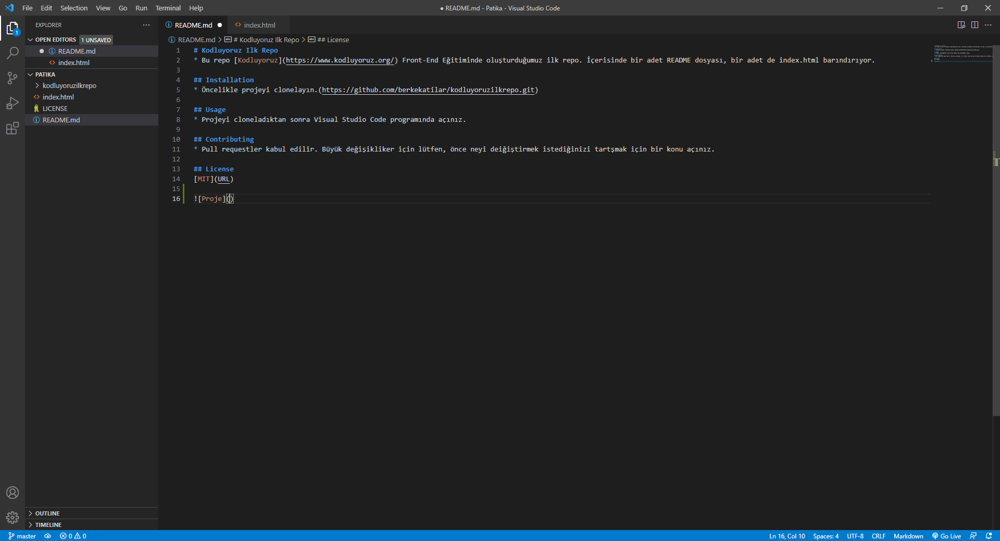

# Kodluyoruz Ilk Repo
* Bu repo [Kodluyoruz](https://www.kodluyoruz.org/) Front-End Eğitiminde oluşturduğumuz ilk repo. İçerisinde bir adet README dosyası, bir adet de index.html barındırıyor.

## Installation
* Öncelikle projeyi clonelayın.(https://github.com/berkekatilar/kodluyoruzilkrepo.git)

## Usage
* Projeyi cloneladıktan sonra Visual Studio Code programında açınız.

## Contributing
* Pull requestler kabul edilir. Büyük değişikliker için lütfen, önce neyi deiğiştirmek istediğinizi tartşmak için bir konu açınız.

## License
[MIT](URL)

